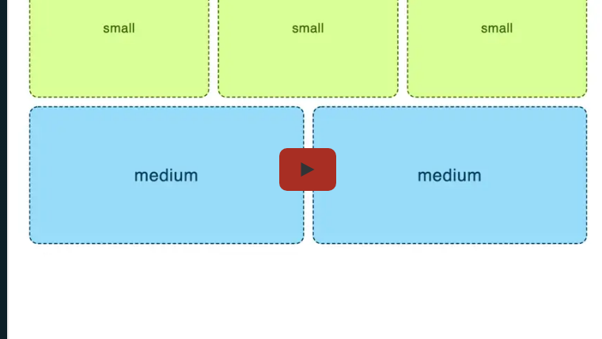
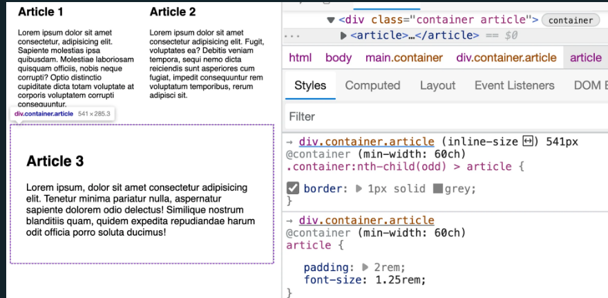
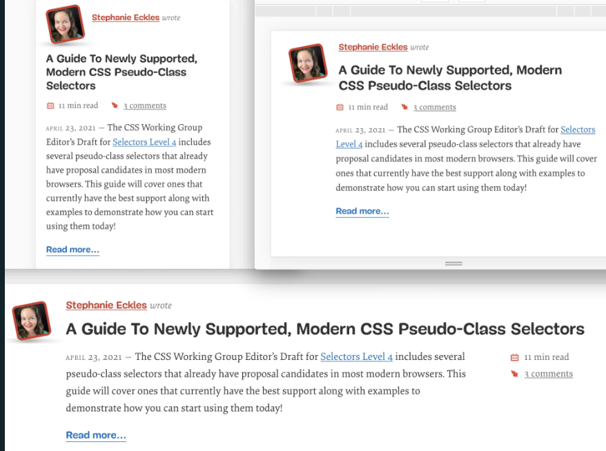
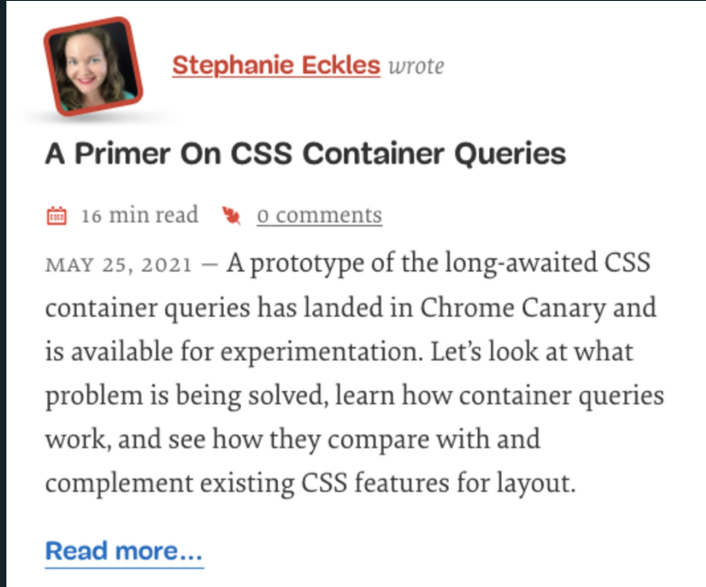
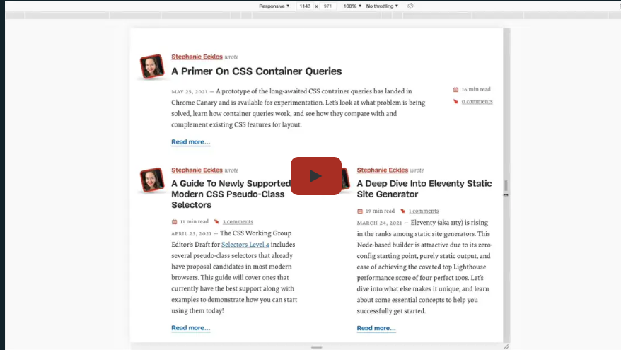

<!-- Tutorial on Container Queries -->


[Smashing Magazine](https://www.smashingmagazine.com/2021/05/complete-guide-css-container-queries/)

[**Stephanie-Eckles**](https://www.smashingmagazine.com/author/stephanie-eckles/)

# **A Primer On CSS Container Queries**

-   **Smashing Magazine**
-   [**Article**](https://www.smashingmagazine.com/2021/05/complete-guide-css-container-queries/)

#### **QUICK SUMMARY**:

-   CSS container queries have landed and are now available for experimentation. Let’s look at what problem is being solved, learn how container queries work, and see how they compare with and complement existing CSS features for layout.

-   **Update 15.09.2022**: Container queries are now supported from the following versions: Chromium and Edge (105+) and Safari (16+). Please keep in mind that the spec is in progress, and could change at any time. You can
    [review the draft document](https://drafts.csswg.org/css-contain-3/) which will update as the spec is formed.

### **What Problem Are CSS Container Queries Solving?**

-   Over a decade ago, Ethan Marcotte introduced us to [the concept of responsive design](https://alistapart.com/article/responsive-web-design/). Central to that idea was the availability of CSS media queries which allowed setting various rules depending on the size of the viewport. The iPhone had been introduced three years prior, and we were all trying to figure out how to work within this new world of contending with both mobile screen sizes and desktop screen sizes (which were much smaller on average than today).

-   Before and even after responsive design was introduced, many companies dealt with the problem of changing layout based on screen size by delivering completely different sites, often under the subdomain of m. Responsive design and media queries opened up many more layout solutions, and many years of creating best practices around responding to viewport sizes. Additionally, frameworks like [Bootstrap](https://getbootstrap.com/) rose in popularity largely due to providing developers responsive grid systems.

-   In more recent years, design systems and component libraries have gained popularity. There is also a desire to build once, deploy anywhere. Meaning a component developed in isolation is intended to work in any number of contexts to make building complex interfaces more efficient and consistent.

-   At some point, those components come together to make a web page or application interface. Currently, with only media queries, there is often an extra layer involved to orchestrate mutations of components across viewport changes. As mentioned previously, a common solution is to use responsive breakpoint utility classes to impose a grid system, such as frameworks like Bootstrap provide. But those utility classes are a patch solution for the limitations of media queries, and often result in difficulties for nested grid layouts. In those situations, you may have to add many breakpoint utility classes and still not arrive at the most ideal presentation.

-   Or, developers may be using certain CSS grid and flex behaviors to approximate container responsiveness. But [flex and CSS grid solutions](https://moderncss.dev/container-query-solutions-with-css-grid-and-flexbox/) are restricted to only loosely defining layout adjustments from horizontal to vertical arrangements, and don’t address the need to modify other properties.

-   Container queries move us beyond considering only the viewport, and allow any component or element to respond to a defined container’s width. So while you may still use a responsive grid for overall page layout, a component within that grid can define its own changes in behavior by querying its container. Then, it can adjust its styles depending on whether it’s displayed in a narrow or wide container.


-   See the Pen [Container Queries — Minimal Flexbox Grid Layout Example](https://codepen.io/smashingmag/pen/QWqJbrW) by [Stephanie Eckles](https://codepen.io/5t3ph).

####  [Container queries move us beyond considering only the viewport, and allow any component or element to respond to a defined container’s width.](https://twitter.com/share?text=%0a%20Container%20queries%20move%20us%20beyond%20considering%20only%20the%20viewport,%20and%20allow%20any%20component%20or%20element%20to%20respond%20to%20a%20defined%20container%e2%80%99s%20width.%0a&url=https://smashingmagazine.com%2f2021%2f05%2fcomplete-guide-css-container-queries%2f)

-   With container queries, you’ll be able to define a component’s full range of styles in a very precise and predictable way. Perhaps you want to increase or decrease padding, change font sizes, add or remove background images, or completely change the display property and orientation of child elements.

[](https://i.vimeocdn.com/video/1133055837-592e4f0f527d79cd71c31794206ebb61ad3593301cdeb70e6a08e3b22f15914e-d.webp?mw=1100&mh=619&q=70)
We’ll look at more examples soon, but first let’s learn how to create a container query!

### **Getting Started With CSS Container Queries**

-   The first thing to know about CSS container queries is that “containers” are the elements being queried, but rules within container queries affect only the container descendants. In other words — you may define main as a container, or perhaps article, or even list items. Then, container queries will allow defining rules for how elements within those change across container sizes.
-   If you’ve been following the formation of this spec, you may know that container queries were originally attached to the contain property and the initial combination of layout size. These particular values helped browser vendors prepare for the possibility of container queries. They were setup to solve the issue of infinite looping that could be caused by a child element’s width changing its parent width which changes the child width again.
-   However, there has been a bit of revision to the spec and now there is a new set of properties and a shorthand to define containment. At the most essential level, we’ll create a class to be able to use for defining elements as containers with the following using the container-type property with the inline-size value.
-

```css
.container {
	container-type: inline-size;
}
```

-   Optionally, you can also name your container using the container-name property, or combine both under the shorthand container property. In the shorthand, the container name is defined first followed by a forward slash and then the type of containment.

```css
.container {
	/* shorthand: name / type */
	container: my-container / inline-size;
}
```

Now, before we actually write a query, there are a few more things to know.

####  [When you attach a container query, you are not modifying the container itself, but rather the elements within that container.](https://twitter.com/share?text=%0a%20When%20you%20attach%20a%20container%20query,%20you%20are%20not%20modifying%20the%20container%20itself,%20but%20rather%20the%20elements%20within%20that%20container.%0a&url=https://smashingmagazine.com%2f2021%2f05%2fcomplete-guide-css-container-queries%2f)

-   The use of inline-size creates a containment context for elements within that container. A queried element will use its nearest ancestor with containment applied. This is important, because it is allowed to nest containers. So if you are unaware of what the container is or create a nested container, results for descendants may change.
-   So, what does a container query actually look like? The syntax will be familiar from media queries, as they begin with @container and then accept a definition such as (min-width: 300px). Note that we’re querying against the computed min-width of 300px, not a defined style of min-width: 300px. We’ll see this represented shortly in the first query example.

-   Let’s assume we’ve placed our container class on the <main> element, and that it contains a series of <articles>.

```html
<main class="container">
	<article>...</article>
	<article>...</article>
	<article>...</article>
</main>
```

-   Now we can set up a container query to alter the articles and any of their descendants which will be based on the width of main since it’s the containing element. So far in my experimentation, I’ve found it useful to think of these similar to the concept of “mobile-first”, except in this case, it’s “narrowest container first”. Meaning, I’ll define the styles for my smallest expected container first, then use container queries to alter styles as the container grows.

```css
article {
	padding: 1rem;
	font-size: 1rem;
}

@container (min-width: 60ch) {
	article {
		padding: 2rem;
		font-size: 1.25rem;
	}
}
```

-   Note that using a font-relative unit like ch or em is intended to use the font-size of the container, but at the time of writing that is not yet complete. So, for now, this will be using the root font size. There was an issue against the spec for exploring other [features that may become queryable](https://github.com/w3c/csswg-drafts/issues/5989).

-   The rules we added may not be complex, but they are practical. In systems I’ve worked on, adjustments like what we’ve done with padding are handled by creating a series of utility classes that are tied to viewport media queries. Now we can make them more proportionate to elements based on their contained size.

-   If we adjust our main container and define a flex grid so that the articles respond as flex children, we’re going to hit what you might perceive as a pitfall.

```css
main {
	display: flex;
	flex-wrap: wrap;
}

article {
	flex: 1 1 30ch;
}
```

-   What you might expect is that when the article’s width is less than the 60ch we used for our container query is that it would take on the reduced padding and font size. However, since the articles are direct children of main and main is the only containment context, the articles will not change until the width of main is narrower than the container query. We would encounter a similar issue if we’d used CSS grid to lay out the articles.

-   To resolve this, each article needs to have a containing element added in order to correctly query for the width of the flex item. This is because the main element is no longer representative of the element’s width. In this case, the quickest resolution is to add div elements with our container class around each article.

```html
<main class="container">
	<div class="container article"><article>...</article></div>
	<div class="container article"><article>...</article></div>
	<div class="container article"><article>...</article></div>
</main>
```

-   We’ll also need to switch our flex definition from the article to the new div, which we’ve also added the class of article for ease of writing our rule:

```css
.article {
	flex: 1 1 30ch;
}
```

-   The result is that when the main container causes the flex items to wrap, the last article spans the full width and will have the large container styles. Here is a CodePen of this example of [container queries for flexbox children](https://codepen.io/smashingmag/pen/oNGQZxg) (reminder to view in Chrome Canary with container queries enabled as noted at the beginning!).


The articles arranged by flex behavior to have two articles on the first row using the narrow container styles and the last article on the second row spanning full width with large container styles. ([Large preview](https://archive.smashing.media/assets/344dbf88-fdf9-42bb-adb4-46f01eedd629/68fedb19-7f2a-4f59-9cab-e5dce257382d/flex-articles.png))

-   We also kept main as a container. This means we can add styles for the .article class, but they will be in response to the width of main, not themselves. I am anticipating this ability to have rules within container queries responding to multiple layers of containers cause the most confusion for initial implementation and later evaluation and sharing of stylesheets.

-   Updates to browser dev tools will certainly help in making DOM changes that alter these types of relationships between elements and the containers they may query.


Chromium 105+ displays a “pill” in the Elements panel to identify containers, and reveals container rules in in the Styles panel. Hovering the container rule definition displays the computed inline-size. ([Large preview](https://archive.smashing.media/assets/344dbf88-fdf9-42bb-adb4-46f01eedd629/f910647c-9eec-4ea2-b951-4a771da59261/cq-devtools.png))

-   Perhaps an emerging best practice will be to only query one level up within a given @container block, and to enforce children carrying their container with them to reduce the potential of negative impact here. The trade-off is the possibility of more DOM elements as we saw with our article example, and consequently dirtying semantics.

-   Additionally, the newer ability to name containers via container-name will greatly help in being explicit about which level of containment to consider for a particular query.

-   In this example, we saw what happened with both nested containers and also the effects of introducing flex or grid layout into a container. An additional key behavior to note is that when a container query is defined but there’s no actual container ancestors for those queried elements, then containment queries will not resolve.

### **Container Element Selector Rules**

-   Earlier I mentioned that a container cannot itself be styled within a container query (unless it’s a nested container and responding to its ancestor container’s query). However, a container can be used as part of the CSS selector for its children.

-   Why is this important? It allows retaining access to CSS pseudo-classes and selectors that may need to originate on the container, such as :nth-child.

-   Given our article example, if we wanted to add a border to every odd article, we can write the following:

    ```css
    @container (min-width: 60ch) {
    	.container:nth-child(odd) > article {
    		border: 1px solid grey;
    	}
    }
    ```

-   If you need to do this, you may want to use less generic container class names to be able to identify in a more readable way which containers are being queried for the rule.

### **Case Study: Upgrading Smashing Magazine’s Article Teasers**

-   If you visit an author’s profile here on Smashing ([such as mine](https://www.smashingmagazine.com/author/stephanie-eckles/)) and resize your browser, you’ll notice the arrangement of the article teaser elements change depending on the viewport width.

-   On the smallest viewports, the avatar and author’s name are stacked above the headline, and the reading time and comment stats are slotted between the headline and article teaser content. On slightly larger viewports, the avatar floats left of all the content, causing the headline to also sit closer to the author’s name. Finally, on the largest viewports, the article is allowed to span nearly the full page width and the reading time and comment stats change their position to float to the right of the article content and below the headline.


Screenshot of the three layout adjustments described in the previous paragraph. ([Large preview](https://archive.smashing.media/assets/344dbf88-fdf9-42bb-adb4-46f01eedd629/a2c88b2c-ef73-44e3-885c-2c5c322fb781/smashing-articles-original.png))

-   By combining container queries with an upgrade to using CSS grid template areas, we can update this component to be responsive to containers instead of the viewport. We’ll start with the narrow view, which also means that browsers that do not support container queries will use that layout.

-   Now for this demo, I’ve brought the minimum necessary existing styles from Smashing, and only made one modification to the existing DOM which was to move the headline into the header component (and make it an h2).

-   Here’s a reduced snippet of the article DOM structure to show the elements we’re concerned about re-arranging (original class names retained):

```html
<article class="article--post">
	<header>
		<div class="article--post__image"></div>
		<span class="article--post__author-name"></span>
		<h2 class="article--post__title"></h2>
	</header>
	<footer class="article--post__stats"></footer>
	<div class="article--post__content"></div>
</article>
```

-   We’ll assume these are direct children of main and define main as our container:

```css
main {
	container-type: inline-size;
}
```

-   In the smallest container, we have the three sections stacked: header, stats, and content. Essentially, they are appearing in the default block layout in DOM order. But we’ll go ahead and assign a grid template and each of the relevant elements because the template is key to our adjustments within the container queries.

```css
.article--post {
	display: grid;
	grid-template-areas:
		'header'
		'stats'
		'content';
	gap: 0.5rem;
}

.article--post header {
	grid-area: header;
}

.article--post\_\_stats {
	grid-area: stats;
}

.article--post\_\_content {
	grid-area: content;
}
```

-   Grid is ideal for this job because being able to define named template areas makes it much easier to apply changes to the arrangement. Plus, its actual layout algorithm is more ideal than flexbox for how we want to manage to resize the areas, which may become more clear as we add in the container query updates.

-   Before we continue, we also need to create a grid template for the header to be able to move around the avatar, author’s name, and headline.

-   We’ll add onto the rule for .article--post header:

```css
.article--post header {
	display: grid;
	grid-template-areas:
		'avatar name'
		'headline headline';
	grid-auto-columns: auto 1fr;
	align-items: center;
	column-gap: 1rem;
	row-gap: 0.5rem;
}
```

-   If you’re less familiar with grid-template-areas, what we’re doing here is ensuring that the top row has one column for the avatar and one for the name. Then, on the second row, we’re planning to have the headline span both of those columns, which we define by using the same name twice.

-   Importantly, we also define the grid-auto-columns to override the default behavior where each column takes up 1fr or an equal part of the shared space. This is because we want the first column to only be as wide as the avatar, and allow the name to occupy the remaining space.

-   Now we need to be sure to explicitly place the related elements into those areas:

```css
.article--post\_\_image {
	grid-area: avatar;
}

.article--post\_\_author-name {
	grid-area: name;
}

.article--post\_\_title {
	grid-area: headline;
	font-size: 1.5rem;
}
```

-   We’re also defining a font-size for the title, which we’ll increase as the container width increases.

-   Finally, we will use flex to arrange the stats list horizontally, which will be the arrangement until the largest container size:

```css
.article--post\_\_stats ul {
	display: flex;
	gap: 1rem;
	margin: 0;
}
```

**Note**: gap for flexbox is now supported for all modern browsers now! 🎉


The result of the grid template styles, showing the avatar and author name aligned, followed by the headline, then stats, then teaser content. ([Large preview](https://archive.smashing.media/assets/344dbf88-fdf9-42bb-adb4-46f01eedd629/8ab8d74c-1e7a-4401-a2eb-ee99cf49380a/smallest-article-container.png))

-   We can now move to our first of two container queries to create the midsize view. Let’s take advantage of being able to create font-relative queries, and base it on the container exceeding 60ch. In my opinion, making content things relative to line length is a practical way to manage changes across container widths. However, you could certainly use pixels, rems, ems, and possibly more options in the future.

-   For this middle size, we need to adjust both the header and overall article grid templates:

```css
@container size(min-width: 60ch) {
	.article--post header {
		grid-template-areas:
			'avatar name'
			'avatar headline';
		align-items: start;
	}

	.article--post {
		grid-template-areas: 'header header' '. stats' '. content';
		grid-auto-columns: 5rem 1fr;
		column-gap: 1rem;
	}

	.article--post__title {
		font-size: 1.75rem;
	}
}
```

-   At this width, we want the avatar to appear pulled into its own column to the left of the rest of the content. To achieve this, within the header the grid template assigns it to the first column of both rows, and then shifts the name to row one, column two, and the headline to row two, column two. The avatar also needs to be aligned to the top now, so adjust that with align-items: start.

-   Next, we updated the article grid template so that the header takes up both columns in the top row. Following that, we use the . character to assign an unnamed grid area for the first column of the second and third row, preparing for the visual of the avatar appearing in its own column. Then, we adjust the auto columns to make make the first column equivalent to the avatar width to complete the effect.


The midsize container query layout with the avatar visually appearing to be in it’s own column to the left of the rest of the content. ([Large preview](https://archive.smashing.media/assets/344dbf88-fdf9-42bb-adb4-46f01eedd629/0af6f86a-9919-4956-bf1a-db66a506160d/midsize-article-container.png))

-   For the largest container size, we need to move the stats list to appear on the right of the article content, but below the headline. We’ll again use ch units for our “breakpoint”, this time picking 100ch.

```css
@container size(min-width: 100ch) {
	.article--post {
		grid-template-areas: 'header header header' '. content stats';
		grid-auto-columns: 5rem fit-content(70ch) auto;
	}

	.article--post__stats ul {
		flex-direction: column;
	}

	.article--post__title {
		max-width: 80ch;
		font-size: 2rem;
	}

	.article--post__content {
		padding-right: 2em;
	}
}
```

-   To meet all of our requirements, we now need to take care of three columns, which makes the first row a triple repeat of header. Then, the second row starts with an unnamed column shared with content and then stats.

-   Looking at the real version of this page, we see that the article doesn’t span 100% of the width of Smashing’s layout. To retain this cap, within the grid-auto-columns we’re using the fit-content function, which can be read as: “grow up until intrinsic max-width of the content, but no greater than the provided value”. So, we’re saying the column can grow but not exceed 70ch. This does not prevent it from shrinking, so the column remains responsive to its available space as well.

-   Following the content column, we define auto for the stats column width. This means it will be allowed to take the inline space it needs to fit its content.


The largest article component arrangement moves the reading time and comment stats to the right of the main content, and the article content takes up the most horizontal space. ([Large preview](https://archive.smashing.media/assets/344dbf88-fdf9-42bb-adb4-46f01eedd629/5ae7b6c5-2cbd-403e-8339-38b211039302/largest-article-container.png))

-   Now, you may be thinking that we’ve kind of just done media queries but in a slightly different way. Which — if we pause a moment — is kind of great! It should help container queries feel familiar and make them easier to adjust to and include in your workflow. For our demo, it also currently feels that way because our single article is currently responding to one parent element which itself is only responding to the changing viewport.

-   What we’re really done is set the foundation for this article to be dropped in on an article page, or on the home page where the articles are arranged in columns (for the sake of this demo, we’ll ignore the other changes that happen on the home page). As we learned in the intro example, if we want elements to respond to the width of CSS grid tracks or flex items, we need to have them carry their container with them. So let’s add an explicit container element around each article instead of relying on main.

```html
<div class="article--post-container">
	<article class="article--post"></article>
</div>
```

Then, we’ll assign .article--post-container as a container:

```css
.article--post-container {
	container-type: inline-size;
}
```

-   Now, if we create a flex-based grid layout as we did in the intro example, we’ll place one article by itself above that grid, and two within the flex grid. This results in the following adjustments as the containers change size:

[](https://i.vimeocdn.com/video/1133060640-1d21900345afc8721ba83459b47d29942afbf5252af7d8b62dd145ecb943dc2d-d.webp?mw=1100&mh=619&q=70)

-   The video helps demonstrate the changes that are now able to happen completely independently of viewport-based media queries! This is what makes container queries exciting, and why they’ve been sought after by CSS developers for so long.

Here is the full CodePen of this demo including the flex grid:

See the Pen [Container Queries Case Study: Smashing Magazine Article Excerpts](https://codepen.io/smashingmag/pen/YzLNmqa) by [Stephanie Eckles](https://codepen.io/5t3ph).

### **Opportunities And Cautions For Using Container Queries**

-   You can start preparing to use container queries today by including them as a progressive enhancement. By defining styles that work well without container queries, you can layer up enhancements that do use them. Then, unsupporting browsers will still receive a workable — if less than ideal — version.

-   As we look towards the future of being able to use container queries anywhere, here are some possible opportunities where they will be beneficial, as well as some cautions. All of them share one trait: they are scenarios when it’s likely to be considered desirable that layout and style changes will be independent from the viewport.

### **RESPONSIVE TYPOGRAPHY AND CONTAINMENT QUERY LENGTH UNITS**

-   You may be familiar with the concept of responsive or fluid typography. Solutions for making typography update across viewport and element widths have seen many advancements, from JavaScript assisting, to CSS solutions using clamp() and viewport units.

-   We can define responsive typography thanks to being able to change the font-size value across various sizes of contained elements. In fact, we just did this in the example of the Smashing Magazine articles.

-   The spec now also includes “[container query length units](https://www.w3.org/TR/css-contain-3/#container-lengths)” which correspond to 1% of the container size in the indicated direction. For purposes of intrinsically responsive typography — that is, typography that responds to the true size of its container — we can use the currently supported cqi unit which is 1% of the container’s inline size. This can swap in for the former viewport solution for the vw unit within a responsive typography clamp solution.

-   While this is exciting from a design and layout point of view, it comes with the same caution as existing fluid typography solutions. For accessibility, a user should be able to zoom the layout and increase font-size to 200% of its original size. If you create a solution that drastically shrinks font size in smaller containers — which may be the computed size upon zoom — a user may never be able to achieve increasing the base font-size by 200%. I’m sure we will see more guidelines and solutions around this as we all get more familiar with container queries!

### **CHANGING DISPLAY VALUES**

-   With container queries, we’ll be able to completely change display properties, such as from grid to flex. Or change their related properties, like update grid templates. This makes way for smoothly repositioning child elements based on the current space allowed to the container.

-   This is the category you’ll find many of the current demos fall into, as it seems to be one of the things that makes the possibility of container queries so exciting. Whereas responsive grid systems are based on media queries tied to viewport width, you may find yourself adding layers of utility classes to get the result you’re really after. But with container queries, you can exactly specify not only a grid system, but completely change it as the element or component grows and shrinks.

-   Possible scenarios include:

    -   changing a newsletter subscription form from horizontal to stacked layout;
    -   creating alternating grid template sections;
    -   changing image aspect ratios and their position versus related content;
    -   dynamic contact cards that reposition avatars and contact details and can be dropped in a sidebar just as easily as a page-width section

-   Here it should be noted that just as in our pre-container query world, for accessibility it’s advised to ensure a logical order especially for the sake of tabbing interactive elements like links, buttons, and form elements.

### **SHOWING, HIDING AND REARRANGING**

-   For more complex components, container queries can step in and **manage variations**. Consider a navigation menu that includes a series of links, and when the container is reduced, some of those links should hide and a dropdown should appear.

-   Container queries can be used to watch sections of the navigation bar and change those individual parts independently. Contrast this to trying to handle this with media queries, where you might opt to design and develop against breakpoints with the result of a compromised, less ideal final solution.

### **DEVELOP ONCE, DEPLOY ANYWHERE**

-   Okay, this might be a bit aspirational. But for design systems, component libraries, and framework developers, container queries will greatly improve the ability to deliver self-defensive solutions. Components’ ability to manage themselves within any given space will reduce complications introduced when it comes time to actually add them into a layout.

-   At first thought, this seems like the dream, especially if you’ve been involved with design system development as I have. However, the pros and cons may be equal for some components, and you may not always want the dynamic layout or repositioning behavior. I anticipate this will be another area best practices will form to perhaps have components opt-in to using container query behavior per instance, such as through a modifier class.

-   For example, consider a card component that assumes that font-size should change. But, in a particular instance, the actual character counts were much longer or much shorter and those rules were suboptimal. An opt-in would likely be easier than trying to override every single container query that was attached.

### **What Might Change In The Spec**

-   Currently, even the syntax is subject to change before the spec is fully finalized. In fact, it’s important to experiment so that as a community we can provide feedback. Miriam Suzanne has created [a GitHub project to track issues](https://github.com/w3c/csswg-drafts/projects/18), and you may react to those and add comments.

**Note**: As of December 8, 2021, the container query spec has now achieved “_Public Working Draft_” status which means it’s an _official work-in-progress in the CSS spec_.

-   Since the first version of this primer released in May 2021, the syntax did change away from the <mark>contain</mark> property to the <mark>container-type</mark>, <mark>container-name</mark>, or shorthand <mark>container</mark> property (now updated in this article).

-   **Resolved important issues**:

    -   How to handle queries when no ancestors have containment defined was resolved to simply have the query fail — as in, no elements including either the body or html will have default containment;
        Availability of container-relative units;
        The spec allows querying based on style features inclusive of custom property values, which is still under development in browsers.

    -   Tangential to the container queries spec is the ability to use “size queries” which allow using a comparison operator such as > to define the query. As an example, @container (width > 100px). Size queries were also released in Chromium 105+ and Safari 16!

### **Additional Demos And Resources**

**If you’d like support for container queries in unsupported browsers**, you can now use the [container queries polyfill](https://github.com/GoogleChromeLabs/container-query-polyfill) from Google Chrome Labs. Una’s article gives a quick container queries summary and provides an [overview of the polyfill](https://developer.chrome.com/blog/cq-polyfill/).

-   Review [Miriam’s CodePen](https://codepen.io/collection/XQrgJo) collection where she is gathering container queries created on that platform
-   Miriam is also keeping this post updated on [the correct container query syntax](<(https://www.oddbird.net/2022/08/18/cq-syntax/)>)
-   Ahmad Shadeed created an [overview with practical examples](https://ishadeed.com/article/say-hello-to-css-container-queries/)
-   Andy Bell considered how to incorporate container queries as a [progressive enhancement for card components](https://piccalil.li/blog/container-queries-are-actually-coming/)
-   Stu Robson has created a GitHub repository to collect resources called [Awesome-Container-Queries](https://github.com/sturobson/Awesome-Container-Queries)
-   David A. Herron wrote [a quick start guide](https://www.oddbird.net/2021/04/05/containerqueries/) with a demonstration of elements that change at different rates based on container queries
-   A page has also been started about [container queries on MDN](https://developer.mozilla.org/en-US/docs/Web/CSS/CSS_Container_Queries).
-   I released [a more condensed overview](https://12daysofweb.dev/2021/container-queries/) that includes the latest syntax updates.
